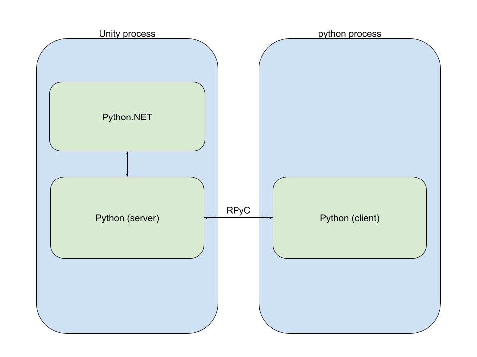

# Using the Out-of-Process API

Python scripts that need to survive the domain reloads triggered by Unity 
(e.g. on C# script change or play state change) need to use the Out-of-Process 
API.

When using the Out-of-Process API, the Python scripts are run in a separate 
process and communicate with Unity using RPyC, a districuted computing 
framework for Python. Unity still runs its own Python interpreter, but it is 
limited to acting as the server for remote Python calls coming from the client 
(the separate process).

The following simplified diagram illustrates the operational mode of the 
Out-of-Process API:



## RPyC Setup

Before using the Out-of-Process API, you need to install the RPyC package. 
To do so, open a command prompt/shell and change directory to your Python 
installation/Scripts (on Windows, typically located at c:\Python27\Scripts). Then 
type the following command:

```
pip install rpyc
```

See [Validating Your Python Installation](validatingPython.html) to know how to 
validate your Python installation (Python, RPyC and PySide). PySide does not 
require to be installed if your code does not use it. RPyC is mandatory though.

## PythonRunner.StartServer()

Before executing Python code on the client process, it is required to start the 
RPyC server. In order to do so, simply call _PythonRunner.StartServer()_. This 
will start the server, but also launch a client process that will be ready to 
execute Python code.

## PythonRunner.RunStringOnClient

We can adapt the [In-Process API](inProcessAPI.html) example to execute in the 
client process this way:

```
using UnityEditor.Scripting.Python;
using UnityEditor;

public class HelloWorld
{
    [MenuItem("Python/Hello World On Client")]
    static void PrintHelloWorldFromPythonOnClient()
    {
        PythonRunner.StartServer();
        PythonRunner.RunStringOnClient("import unity_connection");
        PythonRunner.RunStringOnClient("UnityEngine = unity_connection.get_module(\"UnityEngine\")");
        PythonRunner.RunStringOnClient("UnityEngine.Debug.Log(\"hello world\")");
    }
}
```

The major difference is that instead of importing UnityEngine directly, scripts 
running on the client need to use the unity_connection module.

Also, note that there are currently limitations to this API: 
1. You cannot pass a multi-line script as in the [In-Process API](inProcessAPI.html) example
2. You need to use double-quotes for passing strings to the Python interpreter

Given these limitations, it is sometimes easier to run files in the client 
process, as explained in the following section.

## PythonRunner.RunFileOnClient

Adapting the [In-Process API](inProcessAPI.html) example can be done this way. 
The Python script becomes:

```
import unity_connection
UnityEngine = unity_connection.get_module('UnityEngine')

all_objects = UnityEngine.Object.FindObjectsOfType(UnityEngine.GameObject)
for go in all_objects:
    if go.name[-1] != '_':
        go.name = go.name + '_'
```

And the C# script becomes:

```
using UnityEditor.Scripting.Python;
using UnityEditor;
using UnityEngine;
using System.IO;

public class EnsureNaming
{
    [MenuItem("Python/Ensure Naming On Client")]
    static void RunEnsureNamingOnClient()
    {
        string scriptPath = Path.Combine(Application.dataPath,"ensure_naming.py");
        PythonRunner.StartServer();
        PythonRunner.RunFileOnClient(scriptPath);
    }
}
```

More control can be achieved by using a client init module. It provides an 
interface to the client process that allows building full-fledged applications, as demonstrated in the [PySideExample walkthrough](pysideExampleWalkthrough.html)