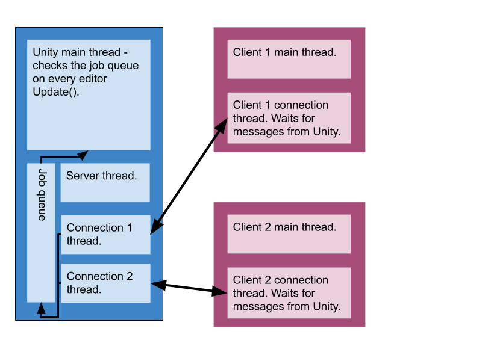

# Using the Out-of-Process API

Python scripts that need to survive the domain reloads triggered by Unity 
(e.g. on C# script change or play state change) need to use the Out-of-Process 
API.

When using the Out-of-Process API, each Python client (or script) is run on a separate 
process and communicates with Unity using RPyC, a distributed computing 
framework for Python. Unity still runs its own Python interpreter, but it is 
limited to acting as the server for remote Python calls coming from the clients 
(in separate processes).

The following diagram illustrates the operational mode of the 
Out-of-Process API:

The Unity process runs the server. It opens a localhost socket on port 18861. 
This allows local users to connect to Unity, but not users elsewhere on the 
internet. This server runs on its own thread, so it can serve clients quickly.

When spawned, clients then connect to the server. When a new client arrives, 
the server creates a new thread for that connection. The new thread waits 
for messages from that client exclusively. Similarly, on the client, a 
thread waits for messages from the server.

Any thread on the server can call PythonRunner.CallServiceOnClient to send a message to
a particular client. Any thread on a client can call functions on the connection object 
to send a message to Unity.

## Deadlocks and coroutines and async/await
Given that we are operating in a multi-threaded, multi-process scenario, there is 
a risk of deadlocks when Unity is stuck waiting on a client, which in turn is stuck 
waiting on Unity.

The most common example is if you have a menu option in the Unity editor that 
calls a service on a client (via PythonRunner.CallServiceOnClient). At that 
point, the main Unity thread is blocked waiting for the client. If the client 
in turn accesses a service on the Unity side, we are likely to hit a deadlock: 
the Unity API must be called via the main thread, but the main thread is blocked

(There’s a 30-second timeout so that instead of completely freezing everything, 
it’ll just be very slow and then you’ll get errors in the console.)

To avoid deadlocks like these, you have a few options:
* Find some way to send the client all the data it needs, as basic types (int 
and string) so that the client need not query Unity in response.
 * If the client side doesn’t need an answer from Unity, make an asynchronous 
call via `rpyc.async_`. It won’t run until after the client returns, but the client 
won’t wait for it to finish.
 * If it does need an answer, keep a reference to the returned [AsyncResult](https://rpyc.readthedocs.io/en/latest/api/core_netref.html#rpyc.core.async_.AsyncResult) 
 and query it periodically until the actual result has arrived.
* On the other hand, if the Unity side doesn’t need an answer from the client: 
use the `PythonRunner.CallCoroutineServiceOnClient` or `PythonRunner.CallAsyncServiceOnClient`
and ignore the returned objects
 * Similarly to Python, if you need the answer, hold on to the IEnumerator or 
 Task returned by the methods until the actual result arrives. Use the coroutine
 version to with `GameObject.StartCoroutine` (or with the Editor Coroutine 
 package). Or call the Async version to use C#'s async/await semantics.
