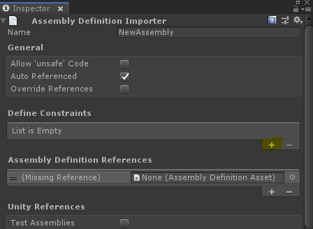

# Using Python in Unity

## Referencing the Python Assembly

For your scripts to be able to recognise the _Unity.Scripting.Python_ namespace 
and interact with the PythonRunner class (or directly use the Python.Runtime 
namespace from Python.Net), you need to create an _Assembly Definition (.asmdef)_ 
file in the same folder you would like to store your C# scripts that 
will interact with Python. You can create one by right-clicking anywhere in your 
Project's folder hierarchy and by clicking _Create_ > _Assembly Definition_.

With the assembly you just created still selected, go to the inspector and add an assembly definition reference:

Using the dialog, select com.unity.scripting.python.editor. Apply your change in the inspector

## Running Python Code from Unity
Included in this package is a simple script called PythonRunner (located in 
the _com.unity.scripting.python.editor_ assembly). It contains the 
_UnityEditor.Scripting.Python.PythonRunner_ class, which can be used for 
calling into the Python interpreter.

It is recommended to always use the PythonRunner class to call into the Python 
interpreter, as the PythonRunner class ensures proper initialization of the 
interpreter.

Simple, stateless Python scripts can be run directly inside of the Unity Editor
process, using the [In-Process API](inProcessAPI.html).

More advanced, stateful scripts (PySide scripts using UI for example) should use
the [Out-of-Process API](outOfProcessAPI.html).
